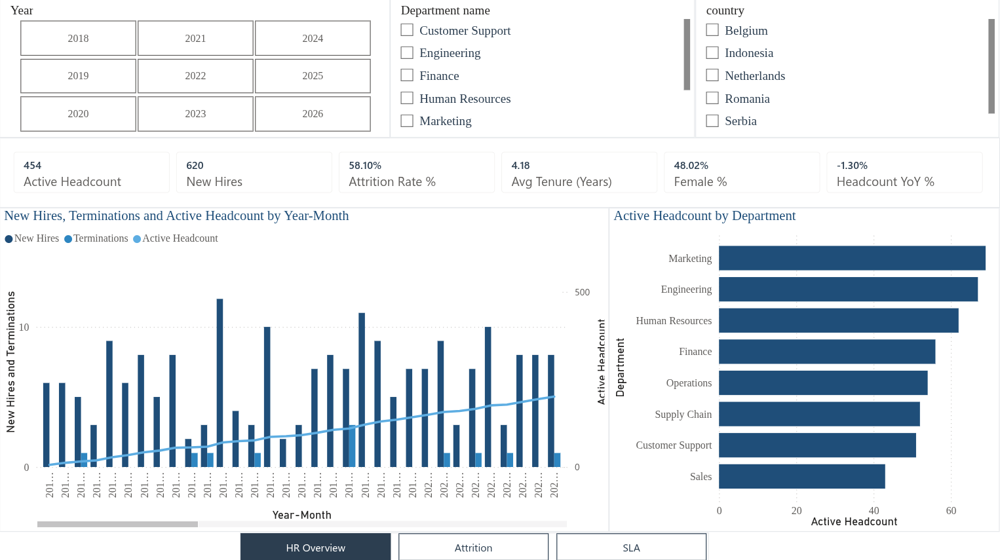
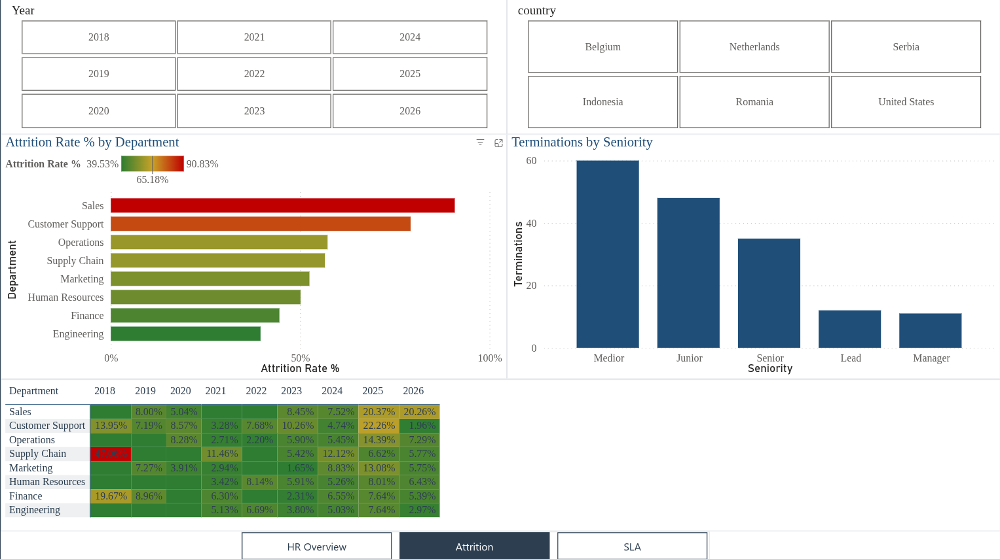
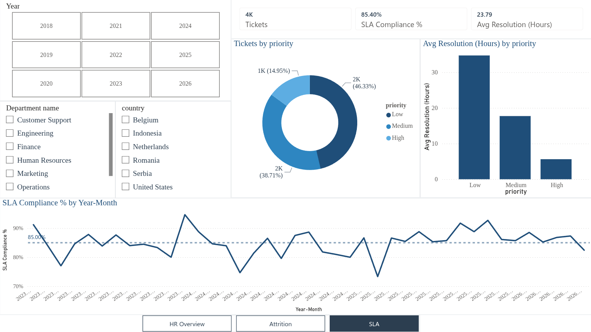

# HR Analytics Dashboard (Power BI)

An end-to-end HR analytics dashboard built in **Power BI** on a **star-schema** data model. Three report pages cover workforce, attrition, and HR service-desk SLAs, using point-in-time and time-intelligence **DAX** measures.

**[Live interactive dashboard](https://app.powerbi.com/view?r=eyJrIjoiNWNkMDQ4ZWItZjdlNC00YTBlLThhYTEtMDAyN2YyMDE3YzhlIiwidCI6IjVhNGVmZTAwLTg2MjMtNGUyMS05ZDUwLTE0YzA5OWU2ZWU3OSIsImMiOjZ9)**

> Data is **synthetic** (generated for this project). No real personal data.

## Pages

**1. HR Overview:** point-in-time headcount, new hires, attrition rate, average tenure, diversity (female %), and headcount YoY; a monthly trend of hires and terminations vs. active headcount; headcount by department; slicers for year, department, and country.

**2. Attrition:** attrition rate by department with green-to-red conditional formatting; a department by year attrition heat-map (matrix); terminations by seniority.

**3. SLA:** ticket volume, SLA compliance %, average resolution time; tickets by priority; average resolution by priority; and monthly SLA compliance against an 85% target line.

## Data model (star schema)

- **Fact:** `FactTickets`
- **Dimensions:** `Dim_Employee`, `Dim_Department`, `Dim_Location`, `Dim_Date`
- Role-playing date relationships (hire date and termination date) are kept **inactive** and activated per-measure via `USERELATIONSHIP`, so the model stays unambiguous.

## Key DAX

- **Point-in-time Active Headcount:** counts everyone hired on or before the end of the selected period who has not left yet (`MAX(Date)` boundary plus `FILTER`), so it recalculates correctly across every month and by any breakdown (department, location, gender).
- **New Hires / Terminations:** `USERELATIONSHIP` on the inactive hire and termination-date relationships.
- **Attrition Rate %:** terminations divided by average monthly headcount over the period (not end headcount, to avoid understating it).
- **SLA Compliance %**, **Avg Resolution (Hours)**, **Headcount YoY %**, including time intelligence.

## Skills demonstrated

Power BI Desktop, DAX (CALCULATE, filter context, time intelligence, USERELATIONSHIP, point-in-time measures), Power Query (ETL and type handling), star-schema modeling, conditional formatting, role-playing dimensions, and publishing to the Power BI Service.

## Screenshots

| Overview | Attrition | SLA |
|---|---|---|
|  |  |  |

## Repository contents

- `HR_Dashboard.pbix` : the Power BI report (open in Power BI Desktop).
- `screenshots/` : page screenshots.
- `hr_data/` : synthetic source CSVs.

---

Built by Miloš Šarenac. [LinkedIn](https://www.linkedin.com/in/milo%C5%A1-%C5%A1arenac-033586141/)
